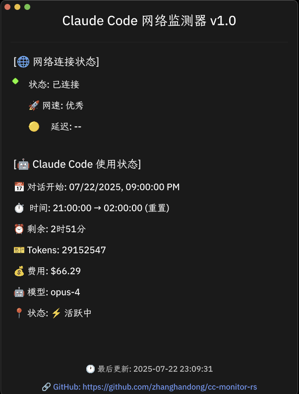

# Claude Code Monitor (Claude Code 监测器)

<p align="center">
  
</p>

<p align="center">
  一款使用 Rust 和 Makepad 开发的实时 Claude Code 使用状态监控工具
</p>

<p align="center">
  <a href="README.md">English</a> | 简体中文
</p>

## 🌍 跨平台支持




这是一个跨平台应用程序，支持运行在：
- 🖥️ **macOS** (10.15+)
- 🐧 **Linux** (Ubuntu、Debian、Arch、Fedora 等)
- 🪟 **Windows** (10/11)

欢迎大家在不同平台上帮助测试应用程序并报告问题！

## ✨ 功能特性

- 🌐 **网络状态监控**
  - 实时 ping 延迟检测
  - TCP 连接速度测试
  - 自动代理检测与支持

- 📊 **Claude Code 使用监控**
  - 实时 Token 使用量追踪
  - 对话状态显示（活跃/已完成）
  - 5 小时会话重置倒计时
  - 模型使用情况（opus-4, sonnet-4 等）
  - 花费统计与成本计算

- 📈 **历史数据分析**
  - 7 天使用趋势图表
  - 每日花费统计
  - 累计使用成本
  - 基于实际 Token 计算，非缓存值

- 🔔 **系统集成**
  - 系统托盘图标与菜单
  - 桌面通知（网络状态变化、定时使用报告）
  - macOS 原生通知支持
  - 每秒实时更新的时间戳

## 📸 截图

<p align="center">
  
</p>

## 🚀 快速开始

### 系统要求

- macOS 10.15+ / Linux / Windows
- Rust 1.70+
- [Claude Code CLI](https://claude.ai/code) 已安装并登录
- Node.js 16+ (用于 ccusage 命令)

#### 平台特定要求

**Linux:**
- GTK3 开发库
- libappindicator（系统托盘支持）
- libxdo（键盘快捷键支持）

```bash
# Ubuntu/Debian
sudo apt install libgtk-3-dev libxdo-dev libappindicator3-dev

# Arch/Manjaro
sudo pacman -S gtk3 xdotool libappindicator-gtk3

# Fedora
sudo dnf install gtk3-devel libxdo-devel libappindicator-gtk3-devel
```

**注意：** 某些基于 GNOME 的发行版可能需要额外的扩展来支持系统托盘。

### 安装

1. **克隆仓库**
   ```bash
   git clone https://github.com/zhanghandong/cc-monitor-rs.git
   cd cc-monitor-rs
   ```

2. **构建项目**
   ```bash
   cargo build --release
   ```

3. **运行应用**
   ```bash
   cargo run --release
   # 或者构建后使用更短的命令：
   ./target/release/cc-monitor-rs
   ```

### 使用 ccm 快速启动

构建后，您可以创建一个便捷的别名：
```bash
# 创建符号链接（类 Unix 系统）
ln -s $(pwd)/target/release/cc-monitor-rs /usr/local/bin/ccm

# 或者添加别名到您的 shell 配置
alias ccm='cargo run --release --bin cc-monitor-rs'
```

### 从发布版本安装

下载适合您系统的预编译二进制文件：

- [macOS (Intel)](https://github.com/zhanghandong/cc-monitor-rs/releases)
- [macOS (Apple Silicon)](https://github.com/zhanghandong/cc-monitor-rs/releases)
- [Linux x64](https://github.com/zhanghandong/cc-monitor-rs/releases)
- [Windows x64](https://github.com/zhanghandong/cc-monitor-rs/releases)

## 🔧 配置

### 代理设置

应用会自动检测系统代理设置。您也可以通过环境变量配置：

```bash
export HTTP_PROXY=http://127.0.0.1:7890
export HTTPS_PROXY=http://127.0.0.1:7890
```

### 更新频率

- 网络和使用状态：每秒更新
- 历史数据：每 60 秒更新
- 桌面通知：每小时一次

## 🏗️ 技术架构

- **UI 框架**: [Makepad](https://makepad.dev/) - 高性能原生 UI
- **编程语言**: Rust - 安全、高效、并发
- **异步运行时**: Tokio - 后台任务管理
- **系统集成**: tray-icon, notify-rust

### 项目结构

```
src/
├── app.rs              # 主应用程序入口
├── ui/                 # UI 组件
│   ├── main_screen.rs  # 主界面
│   └── widgets/        # 自定义组件
├── monitor/            # 监控模块
│   ├── network.rs      # 网络监控
│   └── ccusage.rs      # Claude 使用监控
├── background/         # 后台任务
└── tray.rs            # 系统托盘
```

## 🤝 贡献

欢迎提交 Issue 和 Pull Request！

### 开发环境设置

1. 安装 Rust 工具链
   ```bash
   curl --proto '=https' --tlsv1.2 -sSf https://sh.rustup.rs | sh
   ```

2. 构建和运行
   ```bash
   cargo build
   cargo run
   ```

3. 持续开发
   ```bash
   cargo install cargo-watch
   cargo watch -x run
   ```

## 🗺️ 路线图

查看我们的开发路线图：[中文版](ROADMAP-CN.md) | [English](ROADMAP.md)

## 📝 许可证

本项目采用 MIT 许可证 - 详见 [LICENSE](LICENSE) 文件

## 🙏 致谢

- [Makepad](https://github.com/makepad/makepad) - 出色的 Rust UI 框架
- [Robrix](https://github.com/robius-rs/robrix) - 架构参考
- Claude Code 团队 - 提供优秀的 AI 编程助手

## 📞 联系方式

- 作者：Zhang Handong
- GitHub: [@zhanghandong](https://github.com/zhanghandong)
- 项目主页：[https://github.com/zhanghandong/cc-monitor-rs](https://github.com/zhanghandong/cc-monitor-rs)

---

<p align="center">
  使用 ❤️ 和 Rust 构建
</p>
