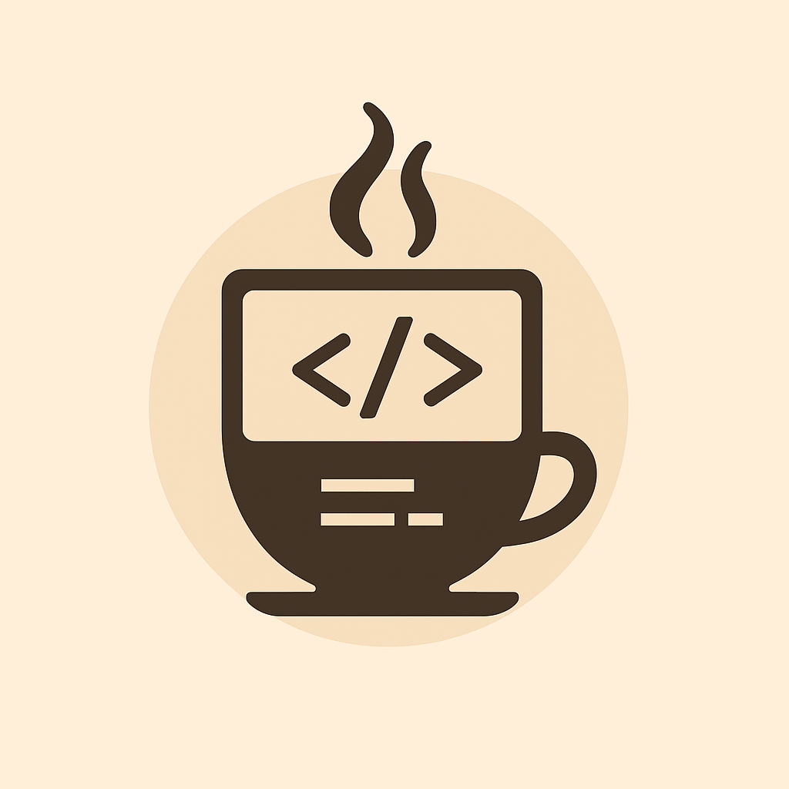

# Claude Code Monitor

<p align="center">
  
  <br>
  <sub>Let Claude code it. Enjoy your cup.</sub>
</p>

<p align="center">
  A real-time Claude Code usage monitor built with Rust and Makepad.
</p>

<p align="center">
  English | <a href="README-CN.md">简体中文</a>
</p>

## 🌍 Cross-Platform Support

This is a cross-platform application that runs on:
- 🖥️ **macOS** (10.15+)
- 🐧 **Linux** (Ubuntu, Debian, Arch, Fedora, etc.)
- 🪟 **Windows** (10/11)

We welcome everyone to help test the application on different platforms and report any issues!

## ✨ Features

- 🌐 **Network Monitoring**
  - Real-time ping latency detection
  - TCP connection speed testing
  - Automatic proxy detection and support

- 📊 **Claude Code Usage Tracking**
  - Live token usage monitoring
  - Session status display (Active/Completed)
  - 5-hour session reset countdown
  - Model usage tracking (opus-4, sonnet-4, etc.)
  - Cost statistics and calculations

- 📈 **Historical Analytics**
  - 7-day usage trend charts
  - Daily cost statistics
  - Cumulative usage costs
  - Based on actual token calculations, not cached values

- 🔔 **System Integration**
  - System tray icon with dropdown menu
  - Desktop notifications (network status changes, periodic usage reports)
  - Native macOS notification support
  - Real-time timestamp updates (per second)

- 🌍 **Internationalization (i18n)**
  - Multi-language support (English, Chinese, Japanese)
  - Automatic system language detection
  - Real-time language switching
  - All UI elements and tray menu fully localized

## 📸 Screenshots

### GUI Mode
<p align="center">
  
</p>

<p align="center">
  
</p>

### TUI Mode (Terminal UI)
<p align="center">
  
</p>

## 🚀 Getting Started

### Prerequisites

- macOS 10.15+ / Linux / Windows
- Rust 1.70+
- [Claude Code CLI](https://claude.ai/code) installed and authenticated
- Node.js 16+ (for ccusage commands)

#### Platform-specific Requirements

**Linux:**
- GTK3 development libraries
- libappindicator (for system tray support)
- libxdo (for keyboard shortcuts)

```bash
# Ubuntu/Debian
sudo apt install libgtk-3-dev libxdo-dev libappindicator3-dev

# Arch/Manjaro
sudo pacman -S gtk3 xdotool libappindicator-gtk3

# Fedora
sudo dnf install gtk3-devel libxdo-devel libappindicator-gtk3-devel
```

**Note:** Some GNOME-based distributions may require additional extensions for system tray support.

### Installation

1. **Clone the repository**
   ```bash
   git clone https://github.com/zhanghandong/cc-monitor-rs.git
   cd cc-monitor-rs
   ```

2. **Build the project**
   
   **For Linux users**: Different distributions require different system tray libraries:
   - **KDE Neon / Ubuntu with KDE**: Use the provided build script
     ```bash
     ./build-linux.sh
     ```
   - **Linux Mint / Ubuntu MATE**: Standard build works
     ```bash
     cargo build --release
     ```
   - For detailed Linux build instructions, see [Linux Tray Dependencies](docs/LINUX_TRAY_DEPENDENCIES.md)
   
   **For macOS/Windows users**:
   ```bash
   cargo build --release
   ```

3. **Run the application**
   
   **GUI Mode (default)**:
   ```bash
   cargo run --release
   # Or use the binary directly:
   ./target/release/cc-monitor-rs
   ```
   
   **Terminal UI Mode**:
   ```bash
   cargo run --release -- --tui
   # Or use the binary directly:
   ./target/release/cc-monitor-rs --tui
   ```

### Quick Start with ccm

After building, you can create a convenient alias:
```bash
# Create a symbolic link (Unix-like systems)
ln -s $(pwd)/target/release/cc-monitor-rs /usr/local/bin/ccm

# Or add aliases to your shell configuration
alias ccm='cargo run --release --bin cc-monitor-rs'
alias ccm-tui='cargo run --release --bin cc-monitor-rs -- --tui'
```

## 🎆 Usage Guide

### Prerequisites
1. **Ensure Claude Code is running**:
   ```bash
   claude code
   ```

2. **Choose your interface**:
   - **GUI Mode**: Native window with system tray integration
   - **TUI Mode**: Terminal-based interface for SSH/remote access

### GUI Mode Features
- Native window with real-time updates
- System tray icon with status menu
- Desktop notifications
- Language selector in UI
- Visual charts and indicators

### TUI Mode Features
- Full monitoring in terminal
- Keyboard navigation
- ASCII/Unicode charts
- Color-coded status
- Language switching (`l` key)

### Keyboard Shortcuts (TUI)
| Key | Action |
|-----|--------|
| `q`, `Esc` | Quit application |
| `r` | Refresh data |
| `l` | Cycle languages |
| `Tab` | Switch panels |
| `↑`/`↓` | Navigate items |
| `Ctrl+C` | Force quit |

### Install from Release

Download pre-built binaries for your platform:

- [macOS (Intel)](https://github.com/zhanghandong/cc-monitor-rs/releases)
- [macOS (Apple Silicon)](https://github.com/zhanghandong/cc-monitor-rs/releases)
- [Linux x64](https://github.com/zhanghandong/cc-monitor-rs/releases)
- [Windows x64](https://github.com/zhanghandong/cc-monitor-rs/releases)

## 🔧 Configuration

### Proxy Settings

The application automatically detects system proxy settings. You can also configure via environment variables:

```bash
export HTTP_PROXY=http://127.0.0.1:7890
export HTTPS_PROXY=http://127.0.0.1:7890
```

### Update Intervals

- Network & usage status: Every second
- Historical data: Every 60 seconds
- Desktop notifications: Hourly

## 🏗️ Architecture

- **UI Framework**: [Makepad](https://makepad.dev/) - High-performance native UI
- **Language**: Rust - Safe, efficient, concurrent
- **Async Runtime**: Tokio - Background task management
- **System Integration**: tray-icon, notify-rust

### Project Structure

```
src/
├── app.rs              # Main application entry
├── ui/                 # UI components
│   ├── main_screen.rs  # Main screen
│   └── widgets/        # Custom widgets
├── monitor/            # Monitoring modules
│   ├── network.rs      # Network monitoring
│   └── ccusage.rs      # Claude usage monitoring
├── background/         # Background tasks
└── tray.rs            # System tray
```

## 🤝 Contributing

Issues and Pull Requests are welcome!

### Development Setup

1. Install Rust toolchain
   ```bash
   curl --proto '=https' --tlsv1.2 -sSf https://sh.rustup.rs | sh
   ```

2. Build and run
   ```bash
   cargo build
   cargo run
   ```

3. For continuous development
   ```bash
   cargo install cargo-watch
   cargo watch -x run
   ```

## 🗺️ Roadmap

Check out our development roadmap: [ROADMAP.md](ROADMAP.md) | [中文版](ROADMAP-CN.md)

## 📝 License

This project is licensed under the MIT License - see the [LICENSE](LICENSE) file for details.

## 🙏 Acknowledgments

- [Makepad](https://github.com/makepad/makepad) - Excellent Rust UI framework
- [Robrix](https://github.com/robius-rs/robrix) - Architecture reference
- Claude Code Team - For providing an excellent AI programming assistant

## 📞 Contact

- Author: Zhang Handong
- GitHub: [@zhanghandong](https://github.com/zhanghandong)
- Project: [https://github.com/zhanghandong/cc-monitor-rs](https://github.com/zhanghandong/cc-monitor-rs)

---

<p align="center">
  Built with ❤️ and Rust
</p>
